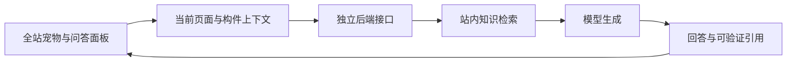

# AI 拓展升级为全站悬浮学习伙伴：审计与调研

日期：2026-10-08。范围：当前新版网站的源码、内容数据、桌面与移动端页面抽查，以及公开官方资料。**本轮仅审计与方案，不修改应用代码、不接入收费 API、不发布。**

## 1. 建议结论

建议将 AI 拓展升级为「构造伙伴」（暂定名）：一个可收起、可停靠的轻量宠物入口，配合问答面板，持续存在于当前网站的各个页面。它根据当前课程、节点、选中构件或训练题，解释构造知识，并提供可打开的资料来源。

推荐实施组合：**自定义宠物与问答界面 + 页面上下文适配 + 站内知识检索 + 独立后端接口**。外观延续网站的蓝白色、极简几何与既有 Logo。第一版使用 SVG/CSS 与已有动画库，不增加持续渲染的宠物 WebGL 画布。

第一版的价值应落在四个动作：解释当前内容、解释选中构件、提供训练提示、推荐关联课程。拟人化动作服务于这些动作。

本报告中「建议」「拟定」「验收目标」均为后续设计，尚未实现。

## 2. 现状与可复用基础

### 2.1 内容规模

通过读取当前配置统计，未调用模型服务：

| 项目 | 当前数量 | 对 AI 的意义 |
| --- | ---: | --- |
| 节点定义 | 56 | 其中 53 个可用，3 个开发中 |
| 单模型构件知识记录 | 349 | 已有名称、材料、厚度、说明等字段 |
| 多方案构件知识记录 | 12 | 必须携带方案身份，避免同名构件混淆 |
| 课程白名单页面 | 49 | 38 页包含空正文标记；其他页也不能直接视为完整教材正文 |
| 训练模式 / 题目 | 8 / 17 | 可接入题目提示和作答后解释 |
| 当前推荐建筑案例 | 法恩斯沃斯住宅 | 有实测图、来源链接和教学主题 |

361 条是知识记录数，不等于互不重复的知识点或全部模型网格数量。课程空正文统计依据 `public/lesson/` 白名单页面中的 `<section class="empty">` 标记。知识库导入前仍须按正文、目录、空白页逐项分类。

### 2.2 已核对的接入点

| 位置 | 已有能力 | 建议接法 |
| --- | --- | --- |
| [routes.tsx](<D:/vscode project/建筑构造交互教材/src/routes.tsx:36>) | `/ai` 与 `/ai-extend` 都是占位页 | 保留旧入口的可达性，后续用于打开全站助手或帮助设置 |
| [AppLayout.tsx](<D:/vscode project/建筑构造交互教材/src/components/AppLayout.tsx:121>) | 所有 SPA 页面共用外壳；首页保持挂载 | 在根外壳挂载唯一助手，放在首页隐藏容器和路由正文之外 |
| [CurriculumFramePage.tsx](<D:/vscode project/建筑构造交互教材/src/pages/CurriculumFramePage.tsx:47>) | 课程使用同源 iframe，已有标题和链接处理 | 从明确的章节路径、标题、正文小节及用户选中文本提供上下文 |
| [nodeDefinitions.ts](<D:/vscode project/建筑构造交互教材/src/data/nodeDefinitions.ts:185>) | 节点、图纸、构件卡片、方案、课程关联集中配置 | 优先作为节点问答事实来源；不复制一套人工维护的卡片 |
| [nodeStore.ts](<D:/vscode project/建筑构造交互教材/src/store/nodeStore.ts:6>) | 已选构件与方案、动画和展开状态 | 按需读取选中状态，解析规范名称；不订阅每帧动画和悬停变化 |
| [trainingStore.ts](<D:/vscode project/建筑构造交互教材/src/store/trainingStore.ts:64>) | 提示标记、答题结果、独立答对记录 | AI 提供本题帮助时接入同一提示规则 |
| [caseStudies.ts](<D:/vscode project/建筑构造交互教材/src/data/caseStudies.ts:129>) | 案例主题和资料链接 | 根据实际访问案例检索，保留教学模型近似与原建筑事实的区别 |

项目已安装 React、Zustand、framer-motion、lucide-react 和 Markdown 渲染组件。未发现已接通的 AI 聊天服务；角色动画和问答接口均需新增。

## 3. 优先处理的审计问题

### A. 接入前必须确定：服务部署与密钥

网站当前发布到 GitHub Pages。GitHub 官方说明其托管的是静态 HTML、CSS、JavaScript，因此模型请求和服务端密钥需要另一个后端服务。前端只保留公开的 API 地址，不能把供应商密钥放进前端包或 `VITE_*` 配置。[GitHub Pages 官方说明](https://docs.github.com/en/pages/getting-started-with-github-pages/what-is-github-pages)

可以评估 Cloudflare Worker 或目标用户访问稳定的其他后端。Worker 支持用 Secrets 存放 API 密钥；实际选型还需验证访问地区、供应商可用性和预算。[Workers Secrets](https://developers.cloudflare.com/workers/configuration/secrets/)

服务端须验证请求、限制输入长度与输出规模、控制并发和超时，并设置额度及费用上限。CORS 来源限制不能代替身份与额度管理。Cloudflare 的限流绑定按节点地点计数且最终一致，不能单独充当精确的全局消费账本。[Workers Rate Limiting](https://developers.cloudflare.com/workers/runtime-apis/bindings/rate-limit/)

本轮未核验任何供应商账号、API 密钥、价格或真实回答质量，因此不承诺具体成本和响应速度。

### B. 全站常驻与课程 iframe

助手应在 AppLayout 中只挂载一次，聊天状态与当前页面上下文分开。跳转页面更新上下文，保留对话；不能因路径变化重新创建整个助手。

当前首页刻意在离开时保持挂载，以保存侧栏、展示模型与页面状态。助手若放进首页的隐藏且 inert 的容器，其他页面会不可用。流式文本更新也不应迫使整个首页和模型树重渲染。

课程正文位于 iframe 内，只读取父页面 DOM 会漏掉课程。使用已知章节白名单和同源文档适配；离开章节时注销其上下文，避免下一页继续引用前一章。

「全站」第一阶段应覆盖现有 `/#/…` 正式路由。直接打开静态 `/lesson/...html` 的页面没有 React 根外壳，需要额外统一入口或加载策略才能覆盖。封存的旧 UI 不应被批量注入助手。

### C. 训练题的答案与成绩规则

当前题目对象在前端包含正确答案、解析和提示。不能把整个对象直接发送给 AI 作为未提交题目的上下文。

未提交时仅提供题干、可见选项/构件、许可提示及必要学习资料；先引导观察再给下一步线索。提交后可以解释错误与相关知识。普通课程问答可以直接解释知识，不必强行反问用户。

AI 针对当前题提供帮助时，应沿用 `showHint` 的提示标记，避免把获得 AI 帮助后的正确作答记录成“首次独立答对”。泛泛询问无关概念无需一律修改本题记录，需要依据是否实际给予本题帮助判定。

这是自主训练的教学策略，不是防作弊机制；正确答案本身已在客户端，无法据此构建安全考试。

### D. 快捷键、遮挡与模型回归

[NodeDetail.tsx](<D:/vscode project/建筑构造交互教材/src/NodeDetail.tsx:79>) 的全局 Escape 会关闭剖面或清除选择；聊天面板 Escape 必须先由当前活动界面消费，避免同时影响模型。已有 R 快捷键会避开 textarea、文本输入和 contenteditable，接入时保留并补充回归验证。

宠物避开模型底部工具栏、构件知识卡片操作、手机底部标签及训练提交按钮。透明外围容器不捕获指针，只有宠物和面板参与点击，避免挡住 Three.js 拖动与拾取。

部分节点设置了 `nonInteractive`，某些楼梯节点没有动画。AI 后续的“查看构件”动作必须尊重这些限制，不能为“无需标注”对象新增高亮，也不能擅自播放、复原、展开或重设镜头。

### E. 问答统计混有模拟数据

[DataAnalysis.tsx](<D:/vscode project/建筑构造交互教材/src/pages/DataAnalysis.tsx:80>) 在首次空记录时写入示例节点和 15 条模拟 AI 问答分类。注释写着“dev only”，代码没有开发环境判断；访问频次图也使用模拟次数。

正式接入 AI 前需区分演示数据与真实事件。旧记录只有分类和日期，不能可靠地按记录判断真假；应设计新的统计版本，保留现有节点访问和训练数据，避免直接清空全部学习记录。聊天历史与统计事件也应分开。

### F. 答案真实性与来源

卡片里的“图中未标注”“具体材料未注明”等限定应进入检索结果，不能被 AI 改写成精确尺寸或规范结论。图纸标注、模型对象名、教学解释、建筑原始资料应保留各自来源。

第一版通过路由、选中构件和资料文本理解当前内容。没有发送并分析图像时，不能声称 AI 已经看懂模型画面、剖面图或真实连接情况。

## 4. 官方案例调研

以下为官方产品或官方技术资料；“本项目借鉴”是结合代码审计作出的设计判断，未测试这些产品在本项目中的接入效果。

| 案例 | 官方资料所述特点 | 本项目借鉴 |
| --- | --- | --- |
| Khanmigo | 结合教育内容，引导学习者思考、发现答案 | 训练题使用分步提示，学习问答解释构造原理。[官方介绍](https://khanmigo.ai/) |
| Duolingo Lily | 学习设计师规定角色行为、难度和对话结构 | 为伙伴设定稳定语气：简洁、耐心、重观察，按用户水平调整解释。[官方设计说明](https://blog.duolingo.com/ai-and-video-call/) |
| Microsoft Mico | 动画角色对对话作视觉回应；当前官方说明它正由 Copilot Voice 转向 Learn Live | 借鉴思考、回应等动作反馈，保持可收起。它是角色设计参考，不是可直接嵌入网站的现成插件。[官方现状](https://support.microsoft.com/en-us/microsoft-365-copilot/frequently-asked-questions-about-retired-copilot-features) |
| Dify 聊天气泡 | 悬浮按钮打开覆盖层；提供位置、尺寸与输入配置 | 可用于知识库试验和快速问答原型，完整宠物外观与实时构件上下文仍需适配。[官方嵌入说明](https://github.com/langgenius/dify-docs/blob/main/en/cloud/use-dify/publish/webapp/embedding-in-websites.mdx) |
| CopilotKit 页面上下文 | `useAgentContext` 提供 UI 到 Agent 的只读数据通道，离开页面自动注销 | 借鉴“知道当前页面与选择，但默认只读”的设计。先用轻量适配实现，复杂工具联动时再评估 SDK。[官方文档](https://docs.copilotkit.ai/agent-spec/shared-state/agent-readonly) |

### 技术方案比较

| 方案 | 优点 | 需要补齐 | 适合程度 |
| --- | --- | --- | --- |
| 自定义宠物与问答 + 独立接口 | 视觉可控，适配现有状态和训练规则，容易保留模型行为 | 知识检索、后端、引用与错误处理需要开发 | **推荐作为正式方案** |
| Dify 默认气泡直接嵌入 | 较快形成知识问答试验 | 宠物外观、选中构件、成绩规则、跨 iframe 上下文 | 适合作为早期验证工具 |
| CopilotKit 等完整 Agent 集成 | 有现成上下文和工具机制 | 新依赖与后端协议，需验证体积和生命周期 | 后期需要多种模型操作时再评估 |

是否使用 Dify 作后台可以与宠物前端独立选择。外观不需要受默认聊天气泡限制。

## 5. 建议的宠物与问答体验

### 5.1 视觉与行为

- 造型：由现有 Logo 的梁、柱几何关系延伸成小型建筑伙伴，蓝白配色，少量眼睛/表情；保持建筑识别度。
- 桌面建议 64–72px，手机 44–56px；这些是待验证的设计尺寸。
- 默认停靠页面边缘，允许拖动并吸附安全位置，支持复位、收起和隐藏。
- 五种状态：待机、准备输入、思考、回应、错误。通过轻微姿态与颜色变化反馈，避免持续大幅跳动。
- 默认不主动弹出大面板、不自动发声。连续待机动画应短暂且可停止；尊重减少动画设置，页面不可见时暂停。[MDN 减少动画说明](https://developer.mozilla.org/en-US/docs/Web/CSS/Reference/At-rules/@media/prefers-reduced-motion)

### 5.2 问答面板

桌面建议宽 360–400px、高不超过视口的 70%，可收起。面板显示：伙伴名称、当前参考对象、聊天记录、来源链接、输入框和停止生成按钮。当前位置用简短标签表示，例如“屋顶 · 圈梁带挑檐板 · 双向钢筋网”。

优先提供三个随页面变化的入口：**讲解当前内容 / 解释这个构件 / 给我学习提示**。答案先用几句话解释，需要时展开详细内容。

桌面以非模态面板为主，允许继续操作模型。手机使用适应键盘和安全区的底部面板；若采用模态，按实际模态行为处理焦点与背景 inert，关闭后返回入口。不能只设置 `aria-modal` 却仍允许背景交互。[W3C 对话框规范](https://www.w3.org/WAI/ARIA/apg/patterns/dialog-modal/)

流式文本不要逐 token 通过读屏播报，也不要在用户阅读上方记录时强制滚到底部。打开手机导航或大图剖面时，应协调显示与焦点，避免多个浮层互相争夺。

### 5.3 分页面能力

| 页面 | 助手知道什么 | 示例能力 |
| --- | --- | --- |
| 首页 | 当前板块、当前展示节点/案例/训练演示 | “这个排水节点有什么特点？” |
| 构造节点目录 | 分类、筛选条件、已有节点 | “想学习屋面变形缝，从哪里开始？” |
| 节点工作台 | 节点、方案、选中构件、对应卡片 | “这层有什么作用？”“与相邻层有什么关系？” |
| 课程章节 | 章节、小节、已有正文、用户选择的文字 | 解释概念、联系已有节点；空章节说明资料尚未提供 |
| 案例应用 | 当前建筑、主题、已核实资料、模型说明 | 解释构造选择；不能把教学练习节点当成原建筑细节 |
| 作业训练 | 实际题号、模式、作答阶段、许可提示 | 提交前引导观察；提交后解释错误与关联知识 |
| 资源 / 数据 / 占位页 | 页面名称和已有功能说明 | 导航和学习建议；明确内容覆盖范围 |

聊天保留跨页历史，当前上下文随页面更新。每条请求固定其发出时的上下文；切换页面后旧答案应标明原页面，防止看起来是在解释新模型。连续发送、停止生成、网络失败需有明确状态。

## 6. 知识与架构建议

### 知识整理

1. **节点卡片与配置**：保留 nodeId、variantId、构件规范名、别名、材料、厚度、说明、图纸路径和当前资源版本。
2. **正式课程正文**：只索引白名单中真正存在的正文；排除导航、按钮、空状态以及课程副本目录，避免重复召回。
3. **当前案例资料**：法恩斯沃斯为默认；旧萨伏伊案例只有在实际访问时使用，保留它的模型简化说明。
4. **扩展内容**：后续人工选入并注明来源、日期及适用范围。涉及尺寸、配比和规范条款时须能核对出处，不能凭通用模型知识补齐。

每个片段有来源 ID 和页面定位。返回的引用只能使用服务端检索到的来源，前端验证引用 ID 与允许的站内路由；AI 不应自由编造页面或构件操作。资料里的文字作为内容，不能当成对助手的系统命令。

可先以“当前节点精确查找 + 构件名称/别名匹配 + 关键词检索”建立基线，使用跨节点问题评估召回，再决定是否需要向量检索。当前数据规模不必先引入大型 Agent 编排。

### 状态与性能

- 宠物/聊天有独立状态容器；模型帧循环和节点状态不因流式回答更新。
- 仅发送必要的上下文和有限轮对话，不发送整个网站 DOM、全部模型网格或用户全部学习记录。
- 用户主动请求时读取模型选择；悬停和动画进度不会自动触发模型 API。
- 初次打开再加载问答面板与较重依赖；关闭时保留会话但暂停无关动画。
- 默认会话可仅保存在当前会话中，是否跨刷新保存应提供选择与清除。只记录必要统计，不默认把全文加入学习画像。
- API 异常时保留草稿与已生成内容，并提供重试和站内资料入口；未接通真实服务时明确显示演示状态。

## 7. 分阶段开发建议

| 阶段 | 可交付成果 | 进入下一阶段的条件 |
| --- | --- | --- |
| 1：宠物与全站外壳 | 角色静态稿、关键状态、停靠/收起、聊天布局、页面上下文标签；模拟内容明确标为演示 | 视觉批准，桌面手机可用，不遮挡重要控件，不破坏现有状态 |
| 2：知识与真实问答 | 首批已核对屋面节点、独立接口、引用、超时和额度控制 | 来源可追溯；未知厚度不臆造；目标网络环境可用 |
| 3：课程、案例与训练 | 课程 iframe 适配、案例来源、训练提示与统计版本 | 不泄露未提交题目答案；提示标记与独立答对一致 |
| 4：受控联动与细化 | 用户点击后定位已有构件/课程、表情打磨；再评估语音等 | 动作白名单生效；不触发禁用构件、不改变动画规则 |

已有首页侧栏、展示模型画布保持、正面初始视角、缩放和旋转行为均列入回归检查。建议先把问答做准，再增加角色表现。

真正接通阶段需要确定后端部署位置、供应商账号与费用上限；这些尚未选择，不影响先完成形态和只读上下文设计。

## 8. 验收清单

- 从首页切换到节点、课程、案例和训练，助手只有一个实例，对话保持，当前页面标签正确。
- 页面刷新后的初始模型、首页侧栏、返回列表位置、课程高度保持现有行为。
- 课程 iframe 内小节切换与选中文本能带入；离开页面不残留错误章节。
- 聊天输入 R 不复原模型；关闭聊天不会同时清除构件或关闭剖面；手机键盘不挡发送按钮。
- 宠物不妨碍画布拖动、缩放、钢筋隐形选择体积和工具栏；尊重静态节点与非交互构件。
- AI 提示后的本题正确结果不计为首次独立答对；已提交训练仍能正常重试与保存。
- 引用打开到实际来源，未标注信息保持未标注；节点/方案/案例身份不混淆。
- 未授权来源中的指令不会改变助手规则；无任意脚本执行或任意模型状态写入。
- 密钥不进入构建产物；429、超时、停止生成、刷新与断网均有可理解状态。
- 同设备比较接入前后模型帧时间，关闭助手时不增加持续渲染；流式输出期间不出现模型闪烁与画布重新挂载。

这些是后续验收目标，不是本轮已经验证通过的 AI 能力。

## 9. 本轮验证与限制

已完成：源码与配置审查、知识规模统计、官方案例与技术资料核验；独立无头 Chromium 在 1440×900 和 390×844 下抽查 AI 拓展、建筑保温 iframe、圈梁带挑檐板节点、构件识别训练，共 8 个页面状态。

抽查未记录页面脚本异常或外层横向溢出；课程标题可从同源 iframe 读取，节点与训练存在可见模型画布。结果位于 `tmp/ai-companion-audit-2026-10-08/results.json`，截图同目录。浏览器使用隔离上下文，未改动用户浏览器中的学习数据。

这次抽查没有测量所有 GLB 加载完成状态、GPU 性能、聊天质量或全部页面功能；不能据此宣称整站完整回归通过。后续新增助手时应按第 8 节专门验证。

仅新增本报告；辅助审计脚本及截图在忽略的 `tmp/` 中。现有应用源码、模型、图纸与发布配置保持原状。
